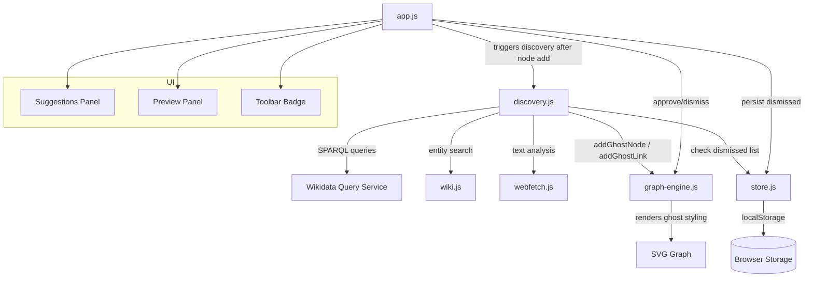
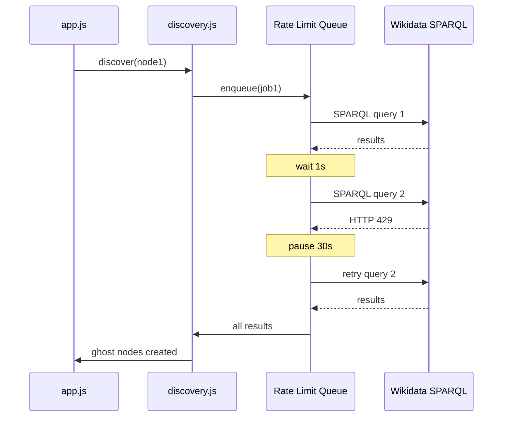

# Design Document: Discovery Engine

## Overview

The Discovery Engine adds an automated suggestion system to the Universal Graph Explorer. When a user adds a node (via Wikidata search, URL fetch, or ghost node approval), the engine analyzes the node's properties and content to find related entities from Wikidata. These suggestions appear as visually distinct "ghost nodes" with dashed borders and reduced opacity. Users approve or dismiss ghost nodes through a preview panel or a centralized suggestions panel. Dismissed entities are persisted so they never reappear.

The system introduces one new module (`js/discovery.js`) and modifies four existing modules (`graph-engine.js`, `store.js`, `app.js`, `index.html`/`css/app.css`). All discovery queries go through the Wikidata SPARQL endpoint with rate limiting to avoid API blocks.

## Architecture



### Data Flow

1. User adds a node (Wikidata entity, URL, or approves a ghost node)
2. `app.js` calls `Discovery.discover(node)` after the node is rendered
3. `discovery.js` checks the node type and properties, builds SPARQL queries or analyzes content
4. Queries are queued through a rate limiter (1s minimum between requests)
5. Results are filtered against existing confirmed nodes and the dismissed list
6. Surviving candidates become ghost nodes via `GraphEngine.addGhostNode()`
7. Ghost nodes render with dashed borders, 50% opacity, smaller radius
8. User clicks a ghost node → preview panel with Approve/Dismiss
9. Approve → converts to confirmed node, triggers new discovery
10. Dismiss → removes ghost node, adds entity ID to dismissed list

## Components and Interfaces

### 1. `js/discovery.js` — Discovery Engine Module

```javascript
const Discovery = {
  // Rate limiting queue
  _queue: [],
  _processing: false,
  _lastRequestTime: 0,
  _pauseUntil: 0,
  MIN_DELAY: 1000,        // 1s between SPARQL requests
  BACKOFF_DELAY: 30000,   // 30s on HTTP 429
  MAX_GHOSTS: 50,         // max ghost nodes in graph
  MAX_PER_CATEGORY: 10,   // max results per query category

  // Entry point — called by app.js after a node is added
  async discover(node) {},

  // Queue a discovery job, process sequentially
  _enqueue(job) {},
  async _processQueue() {},

  // SPARQL-based discovery for Wikidata nodes
  async _discoverFromWikidata(node) {},

  // Content-based discovery for URL-fetched nodes
  async _discoverFromContent(node) {},

  // Geographic proximity discovery
  async _discoverFromLocation(node) {},

  // Execute a SPARQL query with rate limiting
  async _sparql(query) {},

  // Build SPARQL queries per property category
  _buildOccupationQuery(qid, occupationQids) {},
  _buildLocationQuery(qid, locationQids) {},
  _buildMovementQuery(qid, movementQids) {},
  _buildInfluenceQuery(qid, influenceQids) {},
  _buildGeoQuery(regionQid, entityTypes) {},

  // Filter candidates against existing nodes and dismissed list
  _filterCandidates(candidates) {},

  // Create ghost nodes from filtered candidates
  _materializeGhosts(candidates, sourceNodeId, relation) {},

  // Content analysis helpers
  _extractThemes(node) {},
  _searchWikidataForTerms(terms) {},
};
```

### 2. `js/graph-engine.js` — Ghost Node Rendering Extensions

New methods added to the existing `GraphEngine` object:

```javascript
// Add a ghost node (dashed border, 50% opacity, smaller radius)
addGhostNode(id, type, label, data, sourceNodeId) {}

// Add a ghost link (dashed stroke)
addGhostLink(sourceId, targetId, relation) {}

// Convert ghost node to confirmed node
confirmGhost(nodeId) {}

// Remove ghost node and its links
removeGhost(nodeId) {}

// Get all current ghost nodes
getGhostNodes() {}

// Get ghost nodes grouped by source node
getGhostsBySource() {}
```

Ghost nodes are stored in the same `nodes` and `links` arrays but flagged with `ghost: true`. The `rebuild()` method applies conditional styling based on this flag.

### 3. `js/store.js` — Persistence Extensions

New keys and methods added to the existing `Store` object:

```javascript
KEYS: {
  // existing
  nodes: 'uge_nodes',
  links: 'uge_links',
  sources: 'uge_sources',
  // new
  ghostNodes: 'uge_ghost_nodes',
  ghostLinks: 'uge_ghost_links',
  dismissed: 'uge_dismissed',
},

// Ghost node persistence
saveGhosts(ghostNodes, ghostLinks) {},
loadGhosts() {},

// Dismissed list
saveDismissed(dismissedSet) {},
loadDismissed() {},
clearDismissed() {},
```

### 4. `js/app.js` — Controller Extensions

New responsibilities in the app controller:

- Call `Discovery.discover(node)` after `addFromWikidata()`, `addFromUrl()`, and ghost approval
- Handle ghost node clicks → open preview panel with Approve/Dismiss buttons
- Wire up suggestions panel toggle button
- Update badge count when ghost nodes change
- Clear dismissed list when graph is cleared

### 5. UI Components

#### Toolbar Button (in `index.html`)
A new button in `.topbar-right` with a badge showing pending ghost count:
```html
<button id="btn-suggestions" class="btn-icon" title="Suggestions">
  💡<span id="suggestions-badge" class="suggestions-badge hidden">0</span>
</button>
```

#### Suggestions Panel
A slide-out panel (reusing `.panel` pattern) listing all ghost nodes grouped by source:
- Each entry shows: label, type, relationship
- Approve and Dismiss buttons per entry
- Click entry → zoom to ghost node in graph
- Empty state message when no suggestions remain

#### Preview Panel Extension
When a ghost node is clicked, the existing info panel shows:
- Entity label, type, description
- Source of suggestion and relationship to source node
- "Approve" and "Dismiss" buttons (instead of "Expand connections")

## Data Models

### Ghost Node (extends existing node structure)

```javascript
{
  id: 'wiki-Q12345',           // same ID format as confirmed nodes
  type: 'person',              // same type system
  label: 'Claude Monet',
  data: {
    qid: 'Q12345',
    desc: 'French painter',
    discoveredFrom: 'wiki-Q5582',  // source node ID
    discoveryRelation: 'same movement',
    discoveryCategory: 'movement', // occupation|location|movement|influence|content|geo
  },
  radius: 14,                  // smaller than confirmed (person=20 → ghost=14)
  ghost: true,                 // flag distinguishing ghost from confirmed
}
```

### Ghost Link

```javascript
{
  source: 'wiki-Q5582',       // source confirmed node
  target: 'wiki-Q12345',      // ghost node
  relation: 'same movement',
  ghost: true,                 // flag for dashed rendering
}
```

### Dismissed List (in localStorage)

```javascript
// Key: 'uge_dismissed'
// Value: JSON array of entity identifiers
["Q12345", "Q67890", "web-example-com"]
```

### Ghost Radius Scale

| Type         | Confirmed Radius | Ghost Radius |
|-------------|-----------------|-------------|
| person      | 20              | 14          |
| artwork     | 16              | 11          |
| organization| 14              | 10          |
| location    | 12              | 8           |
| category    | 11              | 8           |
| unknown     | 10              | 7           |

### SPARQL Query Patterns

#### Occupation-based discovery
```sparql
SELECT ?item ?itemLabel WHERE {
  ?item wdt:P106 wd:Q1028181 .  # occupation = painter
  ?item wdt:P31 wd:Q5 .         # instance of human
  SERVICE wikibase:label { bd:serviceParam wikibase:language "en". }
}
LIMIT 10
```

#### Movement/genre-based discovery
```sparql
SELECT ?item ?itemLabel WHERE {
  ?item wdt:P135 wd:Q40415 .    # movement = Impressionism
  ?item wdt:P31 wd:Q5 .
  SERVICE wikibase:label { bd:serviceParam wikibase:language "en". }
}
LIMIT 10
```

#### Location-based discovery
```sparql
SELECT ?item ?itemLabel WHERE {
  ?item wdt:P19 wd:Q90 .        # born in Paris
  ?item wdt:P31 wd:Q5 .
  SERVICE wikibase:label { bd:serviceParam wikibase:language "en". }
}
LIMIT 10
```

#### Influence network discovery
```sparql
SELECT ?item ?itemLabel WHERE {
  wd:Q5582 wdt:P737 ?item .     # Van Gogh influenced by ?
  SERVICE wikibase:label { bd:serviceParam wikibase:language "en". }
}
LIMIT 10
```

#### Geographic proximity discovery
```sparql
SELECT ?item ?itemLabel ?typeLabel WHERE {
  VALUES ?type { wd:Q1007870 wd:Q33506 wd:Q2385804 wd:Q483501 }
  ?item wdt:P31 ?type .
  ?item wdt:P131 wd:Q90 .       # located in Paris
  SERVICE wikibase:label { bd:serviceParam wikibase:language "en". }
}
LIMIT 10
```

### Rate Limiting Queue




## Correctness Properties

*A property is a characteristic or behavior that should hold true across all valid executions of a system — essentially, a formal statement about what the system should do. Properties serve as the bridge between human-readable specifications and machine-verifiable correctness guarantees.*

### Property 1: SPARQL query building includes all provided QIDs

*For any* property category (occupation, location, movement, influence) and *for any* non-empty set of Wikidata QIDs, the SPARQL query built by the corresponding builder function SHALL contain every QID from the input set in its WHERE clause.

**Validates: Requirements 2.1, 2.2, 2.3, 2.4, 3.3**

### Property 2: All SPARQL queries enforce result limits

*For any* SPARQL query built by the Discovery Engine (occupation, location, movement, influence, or geographic), the query string SHALL contain a `LIMIT` clause with a value of 10 or less.

**Validates: Requirements 2.5, 4.3**

### Property 3: Candidate filtering excludes confirmed and dismissed entities

*For any* list of candidate entity objects, *any* set of confirmed node IDs, and *any* set of dismissed entity identifiers, the output of `_filterCandidates()` SHALL contain no entity whose identifier appears in either the confirmed set or the dismissed set.

**Validates: Requirements 2.6, 2.7, 4.4, 7.3**

### Property 4: Geographic query includes all required entity types

*For any* region QID, the geographic discovery SPARQL query SHALL include all four entity type QIDs: gallery (Q1007870), museum (Q33506), art school (Q2385804), and artist (Q483501) in its VALUES clause.

**Validates: Requirements 4.2**

### Property 5: Ghost radius is strictly smaller than confirmed radius

*For any* node type in the type system, the ghost node radius for that type SHALL be strictly less than the confirmed node radius for the same type.

**Validates: Requirements 5.4**

### Property 6: Ghost approval restores confirmed node properties

*For any* ghost node of *any* type, after calling `confirmGhost()`, the node SHALL have `ghost` set to `false`, its radius SHALL equal the standard confirmed `RADIUS` for its type, and it SHALL be included in the confirmed nodes persistence.

**Validates: Requirements 6.3, 6.4**

### Property 7: Ghost dismissal removes node and all associated links

*For any* ghost node present in the graph, after calling `removeGhost()`, the node SHALL not appear in the `nodes` array, SHALL not appear in `nodeMap`, and no link in the `links` array SHALL reference the removed node's ID as either source or target.

**Validates: Requirements 6.5**

### Property 8: Dismissed list persistence round-trip

*For any* array of unique entity identifier strings, calling `Store.saveDismissed()` followed by `Store.loadDismissed()` SHALL return an array containing exactly the same identifiers.

**Validates: Requirements 6.6, 7.1**

### Property 9: Ghost node persistence preserves ghost flag and data

*For any* mix of ghost nodes (with `ghost: true`) and confirmed nodes (with `ghost: false`), calling `Store.saveGhosts()` and `Store.save()` followed by `Store.loadGhosts()` and `Store.load()` SHALL return the ghost nodes and confirmed nodes separately, each with their original data intact and ghost flags preserved.

**Validates: Requirements 9.1, 9.3, 9.4**

### Property 10: Ghost nodes grouped correctly by source

*For any* set of ghost nodes each having a `discoveredFrom` source node ID, `getGhostsBySource()` SHALL return a mapping where every ghost node appears exactly once, grouped under its correct `discoveredFrom` source key.

**Validates: Requirements 8.2, 8.5**

### Property 11: Rate limiting queue processes in FIFO order with minimum delay

*For any* sequence of N queued SPARQL requests (N >= 2), the requests SHALL execute in the order they were enqueued, and the timestamp of each request SHALL be at least 1000ms after the timestamp of the previous request.

**Validates: Requirements 10.1, 10.2**

### Property 12: Ghost node count never exceeds maximum

*For any* sequence of discovery operations that produce ghost nodes, the total number of ghost nodes in the graph SHALL never exceed 50 at any point.

**Validates: Requirements 10.4**

## Error Handling

| Scenario | Handling |
|----------|----------|
| SPARQL query network failure | Log to console, show non-blocking status message "Discovery failed for [node label]", skip to next queued job |
| HTTP 429 from Wikidata | Pause entire queue for 30 seconds, then retry the failed request |
| HTTP 5xx from Wikidata | Log error, skip query, continue with next queued job |
| Malformed SPARQL response | Log warning, treat as empty result set, continue |
| localStorage quota exceeded | Catch error in Store.saveGhosts/saveDismissed, log warning, ghost nodes still visible in current session but won't persist |
| Ghost node references a source node that was deleted | Remove orphaned ghost nodes during graph load |
| Content analysis finds no extractable terms | No ghost nodes created, no error shown — silent no-op |
| Discovery called for node with no QID and no text content | Return immediately, no queries dispatched |

## Testing Strategy

### Unit Tests (Example-Based)

- **Discovery triggers**: Verify `Discovery.discover()` is called after `addFromWikidata()`, `addFromUrl()`, and ghost approval (Requirements 1.1, 1.2, 1.3, 6.7)
- **Loading indicator**: Verify indicator appears during discovery and disappears after (Requirement 1.4)
- **Error display**: Mock network failure, verify status message shown (Requirement 1.5)
- **Ghost node rendering**: Create ghost nodes, verify SVG attributes (stroke-dasharray, opacity 0.5) (Requirements 5.1, 5.2, 5.3)
- **Ghost hover**: Simulate mouseover on ghost node, verify opacity changes to 0.8 (Requirement 5.5)
- **Ghost positioning**: Verify initial position is offset from source node (Requirement 5.6)
- **Preview panel content**: Click ghost node, verify panel shows label, type, desc, source, relationship, and both buttons (Requirements 6.1, 6.2)
- **Clear clears dismissed**: Call clear, verify dismissed list is empty (Requirement 7.4)
- **Suggestions panel**: Verify toolbar button exists, panel opens, entries have buttons (Requirements 8.1, 8.4)
- **Zoom on suggestion click**: Click entry in suggestions panel, verify zoomTo called (Requirement 8.3)
- **Empty state**: Remove all ghosts, verify empty message shown (Requirement 8.6)
- **Ghost restore on load**: Save ghosts, reload, verify ghost styling applied (Requirement 9.2)
- **429 backoff**: Mock 429 response, verify 30s pause before retry (Requirement 10.3)

### Property-Based Tests

Property-based tests use [fast-check](https://github.com/dubzzz/fast-check) (JavaScript PBT library). Each test runs a minimum of 100 iterations.

| Test | Property | Tag |
|------|----------|-----|
| SPARQL query contains all input QIDs | Property 1 | Feature: discovery-engine, Property 1: SPARQL query building includes all provided QIDs |
| All queries have LIMIT ≤ 10 | Property 2 | Feature: discovery-engine, Property 2: All SPARQL queries enforce result limits |
| Filter excludes confirmed + dismissed | Property 3 | Feature: discovery-engine, Property 3: Candidate filtering excludes confirmed and dismissed entities |
| Geo query has all 4 entity types | Property 4 | Feature: discovery-engine, Property 4: Geographic query includes all required entity types |
| Ghost radius < confirmed radius | Property 5 | Feature: discovery-engine, Property 5: Ghost radius is strictly smaller than confirmed radius |
| confirmGhost restores properties | Property 6 | Feature: discovery-engine, Property 6: Ghost approval restores confirmed node properties |
| removeGhost cleans up completely | Property 7 | Feature: discovery-engine, Property 7: Ghost dismissal removes node and all associated links |
| Dismissed list save/load round-trip | Property 8 | Feature: discovery-engine, Property 8: Dismissed list persistence round-trip |
| Ghost persistence preserves flags | Property 9 | Feature: discovery-engine, Property 9: Ghost node persistence preserves ghost flag and data |
| Ghosts grouped by source correctly | Property 10 | Feature: discovery-engine, Property 10: Ghost nodes grouped correctly by source |
| Queue FIFO with 1s minimum delay | Property 11 | Feature: discovery-engine, Property 11: Rate limiting queue processes in FIFO order with minimum delay |
| Ghost count ≤ 50 invariant | Property 12 | Feature: discovery-engine, Property 12: Ghost node count never exceeds maximum |

### Integration Tests

- **End-to-end Wikidata discovery**: Add a known entity (e.g., Van Gogh Q5582), verify ghost nodes appear with correct relationships
- **Content-based discovery**: Fetch a test URL, verify extracted terms produce ghost nodes
- **Full approval flow**: Add entity → ghost nodes appear → approve one → new discovery triggers → dismiss another → verify dismissed list
